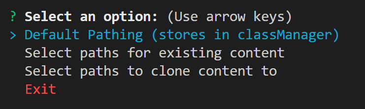
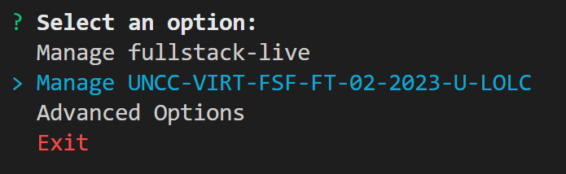
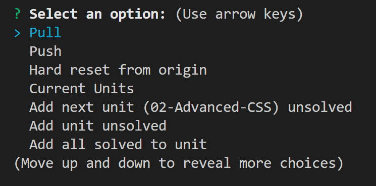

# classManager
CLI for managing class repository

Users can clone the instructional github content and the corresponding student gitlab repository via their respective ssh links.

Once a user has cloned both repositories, the main function of the classManager is to quickly add content to the student gitlab without the hastle of moving folders/files manually or through terminal commands. 

## Installation
- Clone via the ssh link ```git@github.com:merpig/classManager.git```
- To install run ```npm i``` at the root of classManager
- To run the application run ```node .``` at the root of classManager

## Contributing
- Issues
    - If something is broken please add an issue with what's broken, and if possible to the steps to reproduce the issue.

- Suggestions
    - You can find my email on my github profile.
    - A pull request can be made by forking classManager, making changes, and requesting those changes be added.
    - Create an issue with what you'd like to see added and I will look into adding additional features.


## Usage

- Setting up for a new class
    
    - Prompt to clone ssh links from gitlab and github into classManager or selected location on computer
    - Prompt for existing class repositories (github/gitlab)

- Managing gitlab
    
    - After setting up both gitlab and github repos, the second manage option will open up prompts for adding/removing content from the gitlab repository

    

    - ```Pull``` Gets any recent updates made to the gitlab content.
    - ```Push``` Once new content has been added locally, the user will need to select this option to push it up to gitlab.
        - If no new content has been added this will log an error but not break the application.
    - ```Hard reset from origin``` Hard resets the local copy of the student gitlab repo to what's currently on gitlab.
    - ```Current Units``` Displays an array of current units.
    - ```Add next unit``` Adds the next unit with only the unsolved activities to the local student gitlab clone.
        - If no units are added, user will need to use ```Add unit unsolved``` to add the first unit.
    - ```Add unit unsolved``` Select a specific unit to add the local student gitlab clone.
    - ```Add all solved to unit``` Select a unit to add all solved activites to. Does not add solved to the challenge.
    - ```Add selection of solved to unit``` Select a unit to add solved to, then select a starting activity and end activity to add all solved between and including those activities.
    - ```Remove all solved from unit``` Removes all the solved activities from a selected unit.
    - ```Remove selection of solved from unit``` Select a unit to remove solved from, then select a starting activity and end activity to remove all solved between and including those activities.
    - ```Add all solved algorithms unit``` Select a unit to add all the solved algorithms to.
    - ```Remove unit``` Select a unit to remove.
    - ```Back``` Returns to the main prompts.
        - This will occassionally break and not work, due to some missing callbacks. Currently working on a fix.
    - ```Exit``` Exits the application.

- Resetting classManager
    - ```Advanced Options``` Select Reset Class Manager to remove the current github/gitlab clones. Once the application has been exitted the prompts to add a github/gitlab clone will be displayed again.